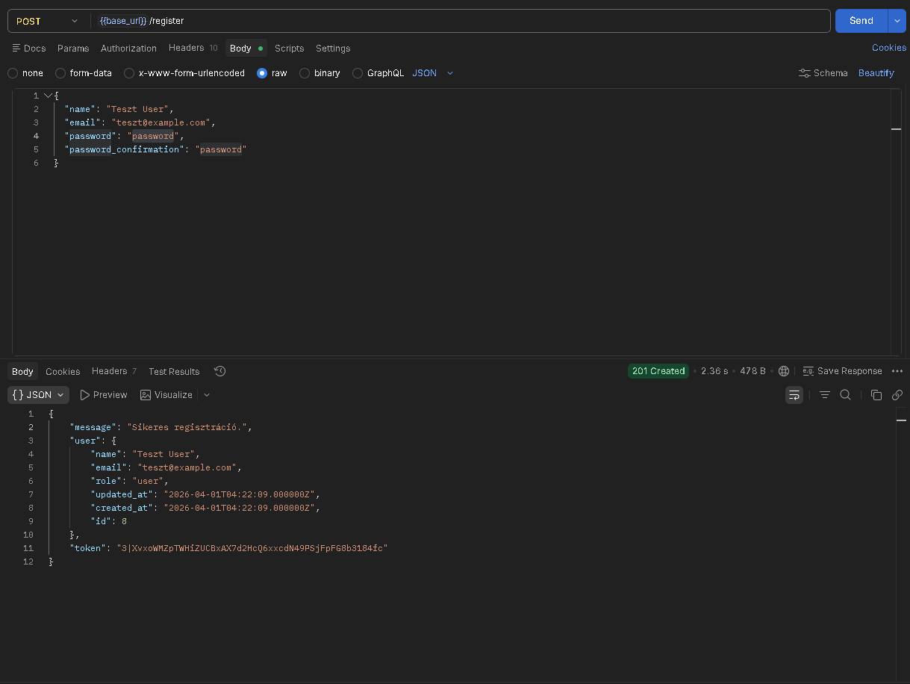
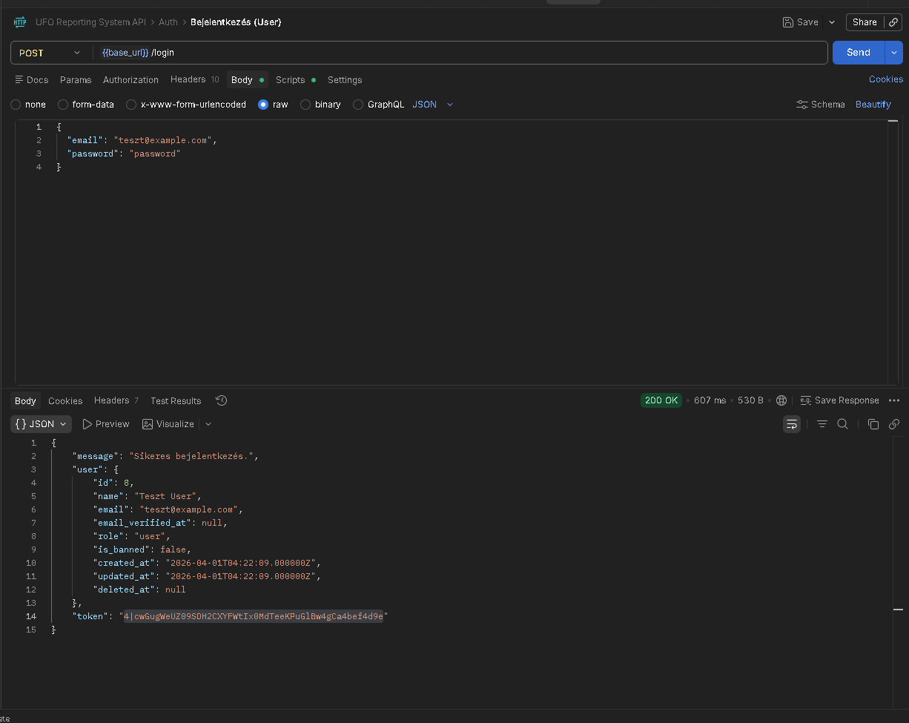
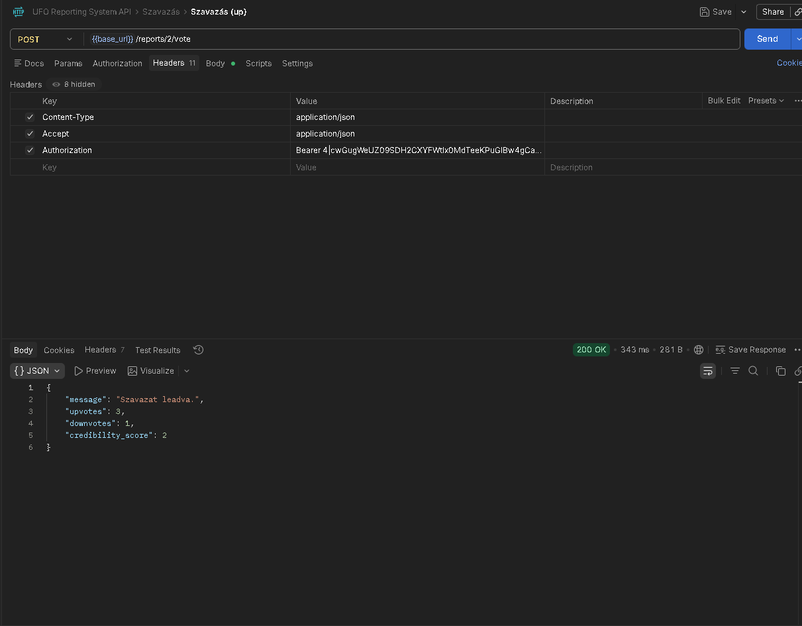
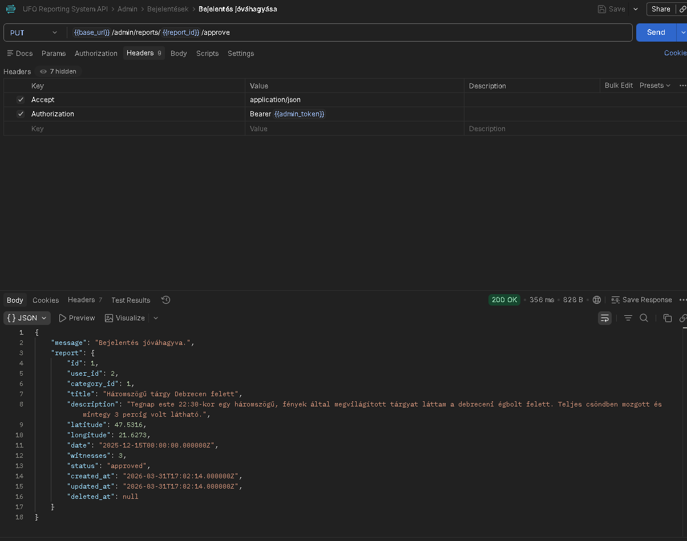
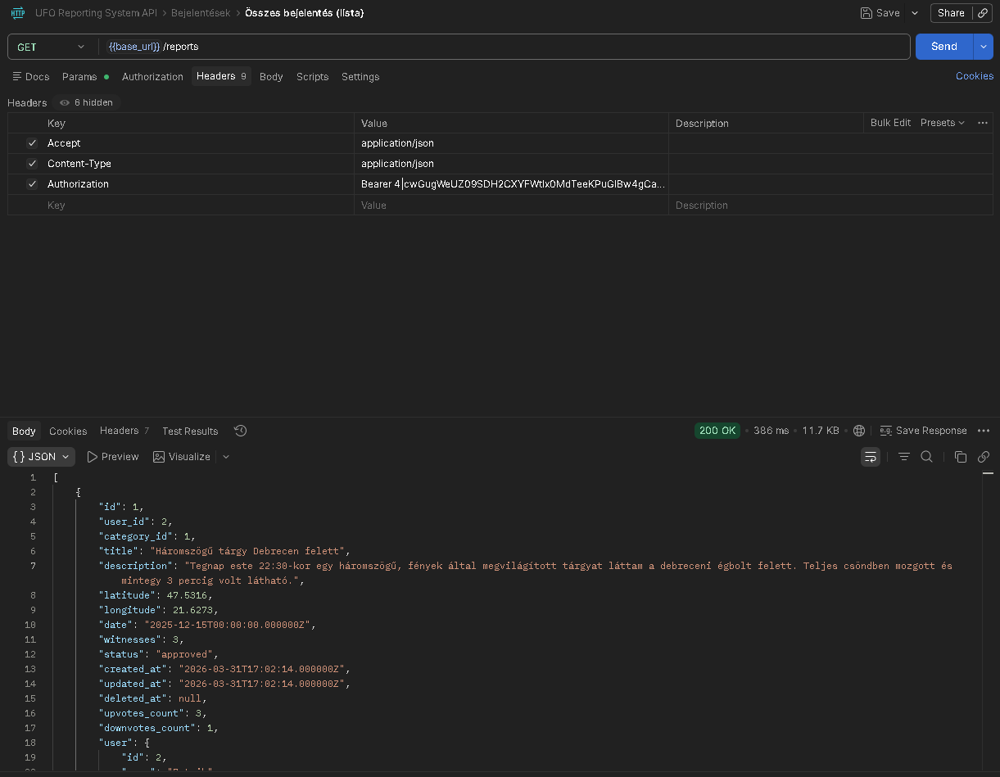

# Backend dokumentáció

## UFO és Paranormális Bejelentő Rendszer – Laravel REST API

---

## Tartalomjegyzék

1. [Áttekintés](#1-áttekintés)
2. [Technológiai stack](#2-technológiai-stack)
3. [Adatbázis struktúra](#3-adatbázis-struktúra)
4. [Modellek és kapcsolatok](#4-modellek-és-kapcsolatok)
5. [Jogosultságkezelés](#5-jogosultságkezelés)
6. [Middleware-ek](#6-middleware-ek)
7. [Form Request validáció](#7-form-request-validáció)
8. [API végpontok](#8-api-végpontok)
9. [Controllerek](#9-controllerek)
10. [Seederek](#10-seederek)
11. [Tesztelés](#11-tesztelés-postmannel)

---

## 1. Áttekintés

A backend egy **Laravel 12** alapú REST API, amely egy paranormális jelenségeket és UFO-észleléseket gyűjtő és moderáló rendszert valósít meg. A rendszerben bejelentkezés nélkül is böngészhető tartalom van, de bejelentések rögzítéséhez, szavazáshoz és adminisztrációhoz regisztráció és hitelesítés szükséges.

Az autentikáció **Laravel Sanctum** Bearer token alapon működik. Alap URL: `http://localhost:8000/api`

**Főbb funkciók:**
- Regisztráció és bejelentkezés Laravel Sanctum tokenes hitelesítéssel
- Paranormális bejelentések (report) létrehozása, szerkesztése, törlése
- Kategóriák kezelése (admin)
- Képfeltöltés bejelentésekhez
- Szavazás (upvote/downvote) a bejelentések hitelességére
- Admin moderálás: jóváhagyás, elutasítás, felhasználó tiltás
- Statisztikák publikus és admin szinten
- Térkép nézethez koordináta-alapú lekérdezés

---

## 2. Technológiai stack

| Komponens        | Verzió / Csomag              |
|------------------|------------------------------|
| PHP              | ^8.2                         |
| Laravel          | ^12.0                        |
| Hitelesítés      | Laravel Sanctum ^4.3         |
| Adatbázis        | MySQL (XAMPP)                |
| Tesztelés        | PHPUnit ^11.5                |
| Dev eszközök     | Laravel Pint, Laravel Pail   |

---

## 3. Adatbázis struktúra

### `users`

| Mező                | Típus                      | Leírás                                |
|---------------------|----------------------------|---------------------------------------|
| `id`                | bigint (PK)                | Egyedi azonosító                      |
| `name`              | string                     | Felhasználó neve                      |
| `email`             | string (unique)            | E-mail cím                            |
| `email_verified_at` | timestamp, nullable        | E-mail megerősítés ideje              |
| `password`          | string (hashed)            | Jelszó (bcrypt)                       |
| `role`              | enum: `user`, `admin`      | Szerepkör, alapértelmezett: `user`    |
| `is_banned`         | boolean                    | Tiltás állapota, default: `false`     |
| `remember_token`    | string, nullable           | Emlékezz rám token                    |
| `created_at`        | timestamp                  | Létrehozás ideje                      |
| `updated_at`        | timestamp                  | Módosítás ideje                       |
| `deleted_at`        | timestamp, nullable        | Soft delete ideje                     |

### `categories`

| Mező          | Típus               | Leírás                      |
|---------------|---------------------|-----------------------------|
| `id`          | bigint (PK)         | Egyedi azonosító             |
| `name`        | string (unique)     | Kategória neve               |
| `description` | text, nullable      | Leírás                      |
| `created_at`  | timestamp           | Létrehozás ideje             |
| `updated_at`  | timestamp           | Módosítás ideje              |
| `deleted_at`  | timestamp, nullable | Soft delete ideje            |

### `reports`

| Mező          | Típus                                   | Leírás                               |
|---------------|-----------------------------------------|--------------------------------------|
| `id`          | bigint (PK)                             | Egyedi azonosító                      |
| `user_id`     | FK → `users.id` (cascade delete)       | Bejelentő felhasználó                 |
| `category_id` | FK → `categories.id` (cascade delete)  | Kategória                             |
| `title`       | string                                  | Bejelentés címe                       |
| `description` | text                                    | Részletes leírás                      |
| `latitude`    | decimal(10,7), nullable                 | GPS szélességi fok                    |
| `longitude`   | decimal(10,7), nullable                 | GPS hosszúsági fok                    |
| `date`        | date                                    | Esemény dátuma                        |
| `witnesses`   | unsigned integer, default: 0            | Tanúk száma                           |
| `status`      | enum: `pending`, `approved`, `rejected` | Moderálás állapota (default: pending) |
| `created_at`  | timestamp                               | Létrehozás ideje                      |
| `updated_at`  | timestamp                               | Módosítás ideje                       |
| `deleted_at`  | timestamp, nullable                     | Soft delete ideje                     |

### `report_images`

| Mező         | Típus                               | Leírás                       |
|--------------|-------------------------------------|------------------------------|
| `id`         | bigint (PK)                         | Egyedi azonosító              |
| `report_id`  | FK → `reports.id` (cascade delete)  | Bejelentés azonosítója        |
| `image_path` | string                              | Kép relatív elérési útja      |
| `created_at` | timestamp, nullable                 | Feltöltés ideje               |
| `deleted_at` | timestamp, nullable                 | Soft delete ideje             |

### `votes`

| Mező        | Típus                               | Leírás                            |
|-------------|-------------------------------------|-----------------------------------|
| `id`        | bigint (PK)                         | Egyedi azonosító                   |
| `report_id` | FK → `reports.id` (cascade delete)  | Bejelentés azonosítója             |
| `user_id`   | FK → `users.id` (cascade delete)    | Szavazó felhasználó                |
| `vote_type` | enum: `up`, `down`                  | Szavazat típusa                   |
| `created_at`| timestamp, nullable                 | Szavazás ideje                    |
| `deleted_at`| timestamp, nullable                 | Soft delete ideje                 |

> **Egyedi megkötés:** `(report_id, user_id)` – egy felhasználó egy bejelentésre csak egyszer szavazhat.

---

## 4. Modellek és kapcsolatok

### `User`

- **Trait-ek:** `HasApiTokens`, `HasFactory`, `Notifiable`, `SoftDeletes`
- **Kapcsolatok:**
  - `reports()` → `hasMany(Report::class)`
  - `votes()` → `hasMany(Vote::class)`
- **Metódus:** `isAdmin(): bool` – visszaadja, hogy a `role` értéke `admin`-e

### `Report`

- **Trait-ek:** `HasFactory`, `SoftDeletes`
- **Kapcsolatok:**
  - `user()` → `belongsTo(User::class)`
  - `category()` → `belongsTo(Category::class)`
  - `images()` → `hasMany(ReportImage::class)`
  - `votes()` → `hasMany(Vote::class)`
- **Accessor:** `getCredibilityScoreAttribute(): int` – upvote−downvote különbsége

### `Category`

- **Trait-ek:** `HasFactory`, `SoftDeletes`
- **Kapcsolat:** `reports()` → `hasMany(Report::class)`

### `ReportImage`

- **Kapcsolat:** `report()` → `belongsTo(Report::class)`

### `Vote`

- **Trait:** `SoftDeletes`
- **Kapcsolatok:**
  - `report()` → `belongsTo(Report::class)`
  - `user()` → `belongsTo(User::class)`

---

## 5. Jogosultságkezelés

A rendszerben **három hozzáférési szint** létezik:

### Vendég (nem bejelentkezett)

- Jóváhagyott bejelentések listázása és megtekintése
- Térkép adatok lekérése
- Kategóriák listázása
- Bejelentés hitelességi pontszámának megtekintése
- Képek megtekintése
- Publikus statisztikák

### Felhasználó (`role = 'user'`)

Minden, amit a vendég elér, plusz:
- Saját profil megtekintése és szerkesztése
- Saját bejelentések listázása
- Bejelentés létrehozása (státusz automatikusan `pending` lesz)
- Saját bejelentés szerkesztése és törlése (soft delete)
- Képek feltöltése és törlése saját bejelentéshez
- Szavazás bejelentésekre (upvote/downvote, visszavonható)

### Admin (`role = 'admin'`)

Minden, amit a felhasználó elér, plusz:
- Összes bejelentés listázása státusztól függetlenül
- Bármely bejelentés törlése
- Bejelentés jóváhagyása / elutasítása
- Felhasználók listázása és keresése
- Felhasználó tiltása / tiltás feloldása (admin nem tiltható)
- Kategóriák létrehozása, szerkesztése, törlése
- Admin statisztikák (részletes, minden státuszra)

> **Megjegyzés:** Tiltott (`is_banned = true`) felhasználó bejelentkezéskor hibaüzenetet kap, tokennel érkező kéréseinél pedig `403` státuszkódot.

---

## 6. Middleware-ek

### `AdminMiddleware` (alias: `admin`)

Ellenőrzi, hogy a bejelentkezett felhasználónak admin szerepköre van-e. Ha nem → `403`.

### `CheckBanned` (alias: `check.banned`)

Ellenőrzi, hogy a bejelentkezett felhasználó nincs-e tiltva. Ha tiltva → `403`.

**Middleware lánc a védett végpontokon:**

```
auth:sanctum  →  check.banned  →  [admin (csak admin útvonalon)]
```

---

## 7. Form Request validáció

### `RegisterRequest`

| Mező       | Szabályok                                                     |
|------------|---------------------------------------------------------------|
| `name`     | kötelező, string, max 255 karakter                            |
| `email`    | kötelező, érvényes email, egyedi a `users` táblában           |
| `password` | kötelező, min 8 karakter, `confirmed` (megegyező megerősítés) |

### `StoreReportRequest`

| Mező          | Szabályok                                               |
|---------------|---------------------------------------------------------|
| `category_id` | kötelező, létező `categories.id`                        |
| `title`       | kötelező, string, max 255 karakter                      |
| `description` | kötelező, string                                        |
| `latitude`    | opcionális, szám, −90 és 90 között                      |
| `longitude`   | opcionális, szám, −180 és 180 között                    |
| `date`        | kötelező, érvényes dátum, nem lehet jövőbeli            |
| `witnesses`   | opcionális, egész szám, minimum 0                       |

> Üres string értékek `latitude`, `longitude`, `witnesses` mezőknél automatikusan `null`-ra konvertálódnak a `prepareForValidation` metódusban.

### `UpdateReportRequest`

Ugyanazok a szabályok, mint `StoreReportRequest`, de minden mező `sometimes` (nem kötelező). Frissítésnél csak a küldött mezők változnak.

### `VoteRequest`

| Mező        | Szabályok                          |
|-------------|------------------------------------|
| `vote_type` | kötelező, értéke: `up` vagy `down` |

### `StoreCategoryRequest` / `UpdateCategoryRequest`

| Mező          | Szabályok                             |
|---------------|---------------------------------------|
| `name`        | kötelező, string, max 255, egyedi     |
| `description` | opcionális, string                    |

---

## 8. API végpontok

### 8.1 Publikus végpontok (hitelesítés nélkül)

| Metódus | Végpont                              | Leírás                                               |
|---------|--------------------------------------|------------------------------------------------------|
| `POST`  | `/api/register`                      | Regisztráció, token visszaadása (`201`)               |
| `POST`  | `/api/login`                         | Bejelentkezés, token visszaadása (`200`)              |
| `GET`   | `/api/reports`                       | Jóváhagyott bejelentések listája (szűrhető, rendezhető) |
| `GET`   | `/api/reports/{report}`              | Bejelentés részletei                                 |
| `GET`   | `/api/map/reports`                   | Térkép nézethez koordináták                          |
| `GET`   | `/api/reports/{report}/credibility`  | Hitelességi pontszám (upvote−downvote)               |
| `GET`   | `/api/reports/{report}/images`       | Bejelentés képeinek listája                          |
| `GET`   | `/api/categories`                    | Kategóriák listája                                   |
| `GET`   | `/api/categories/{category}`         | Egy kategória részletei                              |
| `GET`   | `/api/statistics`                    | Publikus statisztikák                                |

**Szűrők és rendezés a `GET /api/reports` végponton:**

| Paraméter     | Leírás                                                    |
|---------------|-----------------------------------------------------------|
| `category_id` | Szűrés kategória szerint                                  |
| `date_from`   | Szűrés esemény dátumra (tól)                              |
| `date_to`     | Szűrés esemény dátumra (ig)                               |
| `sort_by`     | Rendezési alap: `created_at`, `date`, `title`, `credibility` |
| `sort_dir`    | Rendezési irány: `asc` vagy `desc`                        |

### 8.2 Védett végpontok (`auth:sanctum` + `check.banned`)

| Metódus  | Végpont                           | Leírás                                              |
|----------|-----------------------------------|-----------------------------------------------------|
| `POST`   | `/api/logout`                     | Kijelentkezés, token törlése                        |
| `GET`    | `/api/user`                       | Bejelentkezett felhasználó adatai                   |
| `GET`    | `/api/profile`                    | Saját profil (bejelentések száma is)                |
| `PUT`    | `/api/profile`                    | Profil szerkesztése (name, email, password)         |
| `GET`    | `/api/users/{userId}/reports`     | Felhasználó bejelentéseinek listája                 |
| `POST`   | `/api/reports`                    | Új bejelentés létrehozása (státusz: `pending`)      |
| `PUT`    | `/api/reports/{report}`           | Bejelentés szerkesztése (saját vagy admin)          |
| `DELETE` | `/api/reports/{report}`           | Bejelentés törlése – soft delete (saját vagy admin) |
| `POST`   | `/api/reports/{report}/images`    | Képek feltöltése (max 10 db, max 5 MB/kép)          |
| `DELETE` | `/api/images/{image}`             | Kép törlése (fizikai + soft delete)                 |
| `POST`   | `/api/reports/{report}/vote`      | Szavazás / visszavonás / módosítás                  |

### 8.3 Admin végpontok (`auth:sanctum` + `check.banned` + `admin`, prefix: `/api/admin`)

| Metódus  | Végpont                                | Leírás                                               |
|----------|----------------------------------------|------------------------------------------------------|
| `GET`    | `/api/admin/reports`                   | Összes bejelentés listája (szűrhető status szerint)  |
| `DELETE` | `/api/admin/reports/{report}`          | Bejelentés törlése                                   |
| `PUT`    | `/api/admin/reports/{report}/approve`  | Bejelentés jóváhagyása                               |
| `PUT`    | `/api/admin/reports/{report}/reject`   | Bejelentés elutasítása                               |
| `GET`    | `/api/admin/users`                     | Felhasználók listája (kereshető name és email alapján) |
| `PUT`    | `/api/admin/users/{user}/ban`          | Felhasználó tiltása (admin nem tiltható)             |
| `PUT`    | `/api/admin/users/{user}/unban`        | Tiltás feloldása                                     |
| `POST`   | `/api/admin/categories`                | Új kategória létrehozása                             |
| `PUT`    | `/api/admin/categories/{category}`     | Kategória szerkesztése                               |
| `DELETE` | `/api/admin/categories/{category}`     | Kategória törlése (soft delete)                      |
| `GET`    | `/api/admin/statistics`                | Részletes admin statisztikák                         |

---

## 9. Controllerek

### `AuthController` (`Api\AuthController`)

| Metódus      | HTTP     | Leírás                                                                 |
|--------------|----------|------------------------------------------------------------------------|
| `register()` | `POST`   | Létrehozza a felhasználót, visszaad egy Sanctum tokent (`201`)         |
| `login()`    | `POST`   | Hitelesíti a felhasználót, tiltott fióknál `403`, egyébként tokent ad  |
| `logout()`   | `POST`   | Törli az aktuális hozzáférési tokent                                   |
| `user()`     | `GET`    | Visszaadja a bejelentkezett felhasználó adatait                        |

---

### `ReportController` (`Api\ReportController`)

| Metódus        | HTTP      | Leírás                                                                                 |
|----------------|-----------|----------------------------------------------------------------------------------------|
| `index()`      | `GET`     | Jóváhagyott bejelentések listája; szűrhető (`category_id`, `date_from`, `date_to`), rendezhető (`sort_by`, `sort_dir`) |
| `show()`       | `GET`     | Bejelentés részletei; nem jóváhagyottat csak a tulajdonos vagy admin láthat            |
| `store()`      | `POST`    | Új bejelentés létrehozása, státusz automatikusan `pending`                             |
| `update()`     | `PUT`     | Bejelentés szerkesztése; csak a tulajdonos vagy admin módosíthat                       |
| `destroy()`    | `DELETE`  | Soft delete; csak a tulajdonos vagy admin törölhet                                     |
| `mapReports()` | `GET`     | Koordinátával rendelkező, jóváhagyott bejelentések lekérése térkép nézethez            |

---

### `VoteController` (`Api\VoteController`)

| Metódus         | HTTP   | Leírás                                                                              |
|-----------------|--------|-------------------------------------------------------------------------------------|
| `vote()`        | `POST` | Szavazás leadása, módosítása vagy visszavonása; visszaadja az aktuális szavazatokat |
| `credibility()` | `GET`  | Upvote, downvote és hitelességi pontszám visszaadása                                |

**Szavazás logika:**
- Ugyanolyan szavazat újra leadva → **visszavonás** (`forceDelete`)
- Ellentétes szavazat leadva → **módosítás**
- Nincs korábbi szavazat → **új szavazat** létrehozása

A hitelességi pontszám: `upvotes − downvotes`

---

### `CategoryController` (`Api\CategoryController`)

| Metódus     | HTTP      | Leírás                                                        |
|-------------|-----------|---------------------------------------------------------------|
| `index()`   | `GET`     | Összes kategória listája, bejelentések számával (`reports_count`) |
| `show()`    | `GET`     | Egy kategória részletei                                       |
| `store()`   | `POST`    | Új kategória létrehozása (admin)                              |
| `update()`  | `PUT`     | Kategória szerkesztése (admin)                                |
| `destroy()` | `DELETE`  | Kategória soft delete törlése (admin)                         |

---

### `ImageController` (`Api\ImageController`)

| Metódus     | HTTP      | Leírás                                                                                  |
|-------------|-----------|-----------------------------------------------------------------------------------------|
| `index()`   | `GET`     | Bejelentéshez tartozó képek listája                                                     |
| `store()`   | `POST`    | Képek feltöltése (max 10 db, max 5 MB/kép, formátum: jpeg/png/jpg/gif/webp); tulajdonos vagy admin |
| `destroy()` | `DELETE`  | Kép fizikai törlése + soft delete; tulajdonos vagy admin                                |

---

### `ProfileController` (`Api\ProfileController`)

| Metódus        | HTTP   | Leírás                                                                      |
|----------------|--------|-----------------------------------------------------------------------------|
| `show()`       | `GET`  | Bejelentkezett felhasználó profilja, bejelentések számával                  |
| `update()`     | `PUT`  | Profil szerkesztése (`name`, `email`, `password`); csak a küldött mező változik |
| `userReports()`| `GET`  | Adott `userId`-hez tartozó bejelentések listája szavazatszámokkal           |

---

### `StatisticsController` (`Api\StatisticsController`)

Publikus statisztikákat ad vissza:

| Mező              | Tartalom                                         |
|-------------------|--------------------------------------------------|
| `total_reports`   | Jóváhagyott bejelentések száma                   |
| `total_users`     | Összes felhasználó száma                         |
| `total_votes`     | Összes szavazat száma                            |
| `by_status`       | Bejelentések státusz szerinti megoszlása         |
| `by_category`     | Jóváhagyott bejelentések kategóriánként          |
| `top_credible`    | Top 5 leghitelesebb bejelentés                   |
| `recent`          | Legutóbbi 5 jóváhagyott bejelentés               |

---

### Admin controllerek

#### `Admin\ReportController`

| Metódus      | HTTP      | Leírás                                                         |
|--------------|-----------|----------------------------------------------------------------|
| `index()`    | `GET`     | Összes bejelentés; szűrhető `status` paraméterrel              |
| `destroy()`  | `DELETE`  | Bármely bejelentés soft delete törlése                         |
| `approve()`  | `PUT`     | Bejelentés státuszának `approved`-ra állítása                  |
| `reject()`   | `PUT`     | Bejelentés státuszának `rejected`-re állítása                  |

#### `Admin\UserController`

| Metódus   | HTTP  | Leírás                                                                    |
|-----------|-------|---------------------------------------------------------------------------|
| `index()` | `GET` | Felhasználók listája bejelentések számával; kereshető `name` és `email` alapján |
| `ban()`   | `PUT` | Felhasználó tiltása (`is_banned = true`); admin nem tiltható (`422`)      |
| `unban()` | `PUT` | Felhasználó tiltásának feloldása (`is_banned = false`)                    |

#### `Admin\StatisticsController`

Részletes admin statisztikákat ad vissza:

| Mező                  | Tartalom                                          |
|-----------------------|---------------------------------------------------|
| `reports.total`       | Összes bejelentés                                 |
| `reports.pending`     | Függőben lévő bejelentések                        |
| `reports.approved`    | Jóváhagyott bejelentések                          |
| `reports.rejected`    | Elutasított bejelentések                          |
| `users.total`         | Összes felhasználó                                |
| `users.banned`        | Tiltott felhasználók száma                        |
| `total_votes`         | Összes szavazat                                   |
| `total_categories`    | Összes kategória                                  |
| `top_reports`         | Top 5 leghitelesebb bejelentés (minden státuszra) |
| `reports_by_category` | Bejelentések kategóriánként                       |

---

## 10. Seederek

Az adatbázis feltöltése a `php artisan db:seed` paranccsal történik. A `DatabaseSeeder` a következő sorrendben hívja meg a seedereket:

```
CategorySeeder → UserSeeder → ReportSeeder → VoteSeeder
```

### `CategorySeeder`

9 előre definiált kategóriát hoz létre (`firstOrCreate` segítségével, így ismételt futtatás biztonságos):

| Kategória neve       | Leírás                                             |
|----------------------|----------------------------------------------------|
| UFO Észlelés         | Azonosítatlan repülő tárgyak és légi jelenségek    |
| Földönkívüli         | Idegen lények találkozásai és emlékezetek          |
| Kísértet / Szellem   | Természetfeletti entitások és kisértett helyek     |
| Crop Circle          | Rejtélyes búzamező alakzatok és leszállási nyomok  |
| Bigfoot / Sasquatch  | Nagy emberszabású lény észlelések                  |
| Tengeri Szörny       | Azonosítatlan vízi lények                          |
| Poltergeist          | Zajokkal és tárgyak mozgásával járó jelenségek     |
| Időhurok / Anomália  | Idővel kapcsolatos furcsa tapasztalatok            |
| Egyéb Paranormális   | Minden más megmagyarázhatatlan jelenség            |

---

### `UserSeeder`

7 felhasználót hoz létre (`firstOrCreate`):

| Név           | E-mail               | Szerepkör |
|---------------|----------------------|-----------|
| Admin         | admin@ufo.hu         | `admin`   |
| Patrik        | patrik@ufo.hu        | `user`    |
| Odett         | odett@ufo.hu         | `user`    |
| Kiss Péter    | kisspeter@ufo.hu     | `user`    |
| Horváth Éva   | horvatheva@ufo.hu    | `user`    |
| Sós Elemér    | soselemer@ufo.hu     | `user`    |
| Ali Mihály    | alimihaly@ufo.hu     | `user`    |

Minden felhasználó jelszava: `password` (bcrypt-tel titkosítva).

---

### `ReportSeeder`

Valós magyarországi helyszínekhez kötött bejelentéseket hoz létre a seeded felhasználók nevében. A bejelentések különböző státuszokkal (`approved`, `pending`, `rejected`) és képekkel rendelkeznek. Minden bejelentéshez `ReportImage` rekordok is létrejönnek, amelyek a `public/storage/report_images/` mappában lévő képekre mutatnak.

Példa bejelentések:

| Cím                                         | Kategória            | Státusz    | Helyszín  |
|---------------------------------------------|----------------------|------------|-----------|
| Háromszögű tárgy Debrecen felett            | UFO Észlelés         | `approved` | Debrecen  |
| Furcsa hangok a pécsi várban                | Kísértet / Szellem   | `approved` | Pécs      |
| Búzakör Győr mellett                        | Crop Circle          | `pending`  | Győr      |
| Villogó háromszög Győr felett               | UFO Észlelés         | `approved` | Győr      |
| Árnyalak a kastély ablakában (Nógrád)       | Kísértet / Szellem   | `approved` | Nógrád    |
| Maguktól mozgó tárgyak egy panelben (Miskolc)| Poltergeist         | `approved` | Miskolc   |

---

### `VoteSeeder`

A seeded felhasználók nevében szavazatokat rögzít a bejelentésekre (`Vote::firstOrCreate`). Minden szavazat `up` (felszavazás) vagy `down` (leszavazás) típusú. Néhány példa:

| Bejelentés                                  | Upvote | Downvote |
|---------------------------------------------|--------|----------|
| Rejtélyes lény a bucsa horgásztóban         | 5      | 0        |
| Háromszögű tárgy Debrecen felett            | 3      | 1        |
| Furcsa hangok a pécsi várban                | 2      | 1        |
| Hatalmas lény nyomai a Mátrában             | 3      | 1        |
| Villogó háromszög Győr felett               | 1      | 2        |
| Maguktól mozgó tárgyak egy panelben (Miskolc)| 1     | 3        |

---

## 11. Tesztelés Postmannel

A `ufo-api.postman_collection.json` fájl importálható közvetlenül Postmanbe.

### Lépések az importhoz
1. Postman → **Import** gomb
2. Fájl kiválasztása: `backend/ufo-api.postman_collection.json`
3. **Environment** létrehozása: `base_url = http://localhost:8000/api`

### Tipikus tesztelési folyamat

#### 1. Regisztráció / Bejelentkezés
POST /api/register



A álaszban kapott `token` értékét az `Authorization: Bearer <token>` fejlécbe kell másolni.

#### 2. Bejelentés létrehozása
POST /api/reports



#### 3. Szavazás
POST /api/reports/2/vote



#### 4. Admin: Bejelentés jóváhagyása
PUT /api/admin/reports/1/approve


#### 5. Az össze bejelentés megnézése
GET /api/reports



---


### Tesztelt területek

| Tesztfájl                  | Mit fed le                                               |
|----------------------------|----------------------------------------------------------|
| `AuthTest.php`             | Regisztráció, bejelentkezés, kijelentkezés               |
| `ReportTest.php`           | Lista, részlet, létrehozás, szerkesztés, törlés          |
| `VoteTest.php`             | Szavazás, visszavonás, ellentétes szavazat               |
| `StatisticsTest.php`       | Statisztikai végpont adatstruktúra                       |
| `AdminReportTest.php`      | Moderálás (jóváhagyás, elutasítás, törlés)               |
| `AdminUserTest.php`        | Felhasználó tiltás / feloldás                            |
| `CategoryTest.php`         | Kategória CRUD admin jogosultsággal                      |

### Példa teszteset (sikeres bejelentkezés)

```php
public function test_user_can_login(): void
{
    $user = User::factory()->create(['password' => bcrypt('password')]);

    $response = $this->postJson('/api/login', [
        'email'    => $user->email,
        'password' => 'password',
    ]);

    $response->assertStatus(200)
             ->assertJsonStructure(['token', 'user']);
}
```
